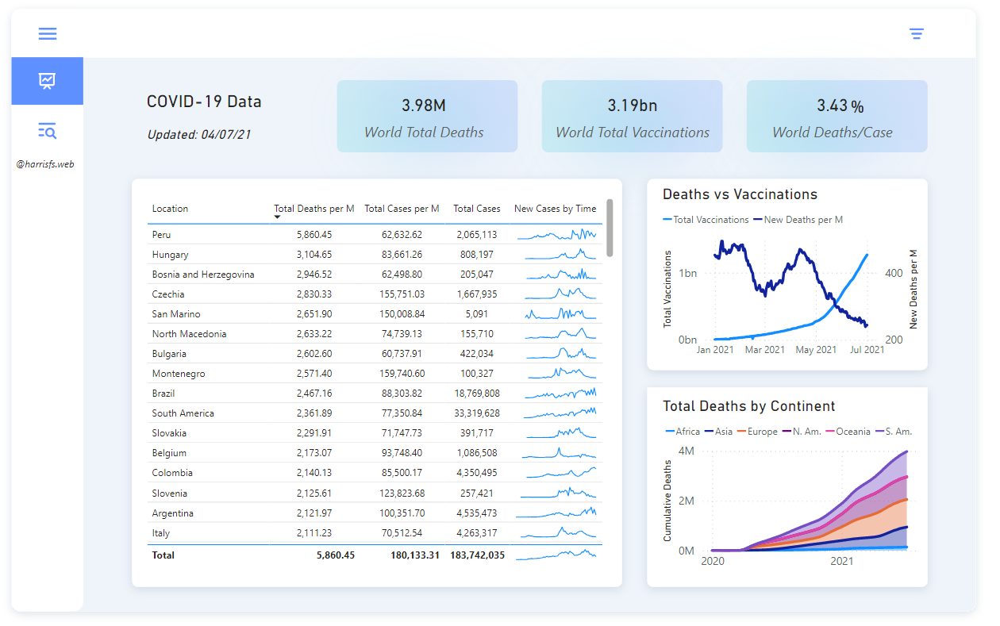
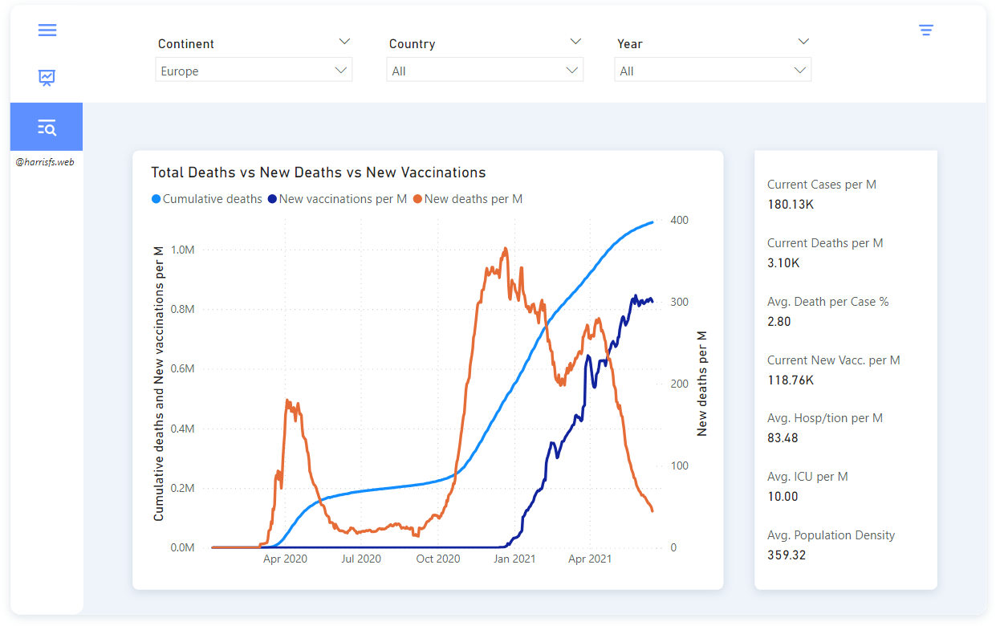

# MySQL Data Exploration for Covid-19 Data

This repository contains SQL queries designed to explore and analyze Covid-19 data using MySQL. The data were sourced from https://ourworldindata.org/covid-deaths and where pre-processed using Excel to split in two separate datasets. After exploring data with MySQL a connection was made using the performed queries with PowerBI to create a report. Screenshots of the report can be found below.

Data are from the start of the pandemic up to 04/07/2021.

## Data Report

## Queries Overview

The queries utilize various SQL features such as joins, common table expressions (CTEs), window functions, aggregate functions, and creating views. Below is an overview of the queries and their purpose:

1. **Basic Data Retrieval**: 
   - Retrieves all records from the `CovidDeaths` table where `continent` is not null, ordered by certain columns.

2. **Initial Data Selection**: 
   - Selects specific columns (`Location`, `date`, `total_cases`, `new_cases`, `total_deaths`, `population`) from `CovidDeaths` table where `continent` is not null, ordered by `Location` and `date`.

3. **Death Percentage Calculation**: 
   - Calculates the death percentage for locations containing 'states' in their name, showing the likelihood of dying if contracting Covid-19 in those locations.

4. **Percentage of Population Infected**: 
   - Calculates what percentage of the population is infected with Covid-19 for each location.

5. **Highest Infection Rates Compared to Population**: 
   - Identifies countries with the highest infection rates compared to their population.

6. **Highest Death Count per Population**: 
   - Lists countries with the highest death count per population.

7. **Death Count by Continent**: 
   - Breaks down the death count by continent, showing continents with the highest death counts per population.

8. **Global Covid-19 Numbers**: 
   - Summarizes global Covid-19 statistics including total cases, total deaths, and death percentage over time.

9. **Percentage of Population Vaccinated**: 
   - Calculates the percentage of the population that has received at least one Covid-19 vaccine dose, using both CTE and temporary table approaches.

10. **Creating a View**: 
    - Creates a view named `PercentPopulationVaccinated` to store data on population vaccination rates for later visualizations.

## Files Included

- `data and setup` folder: containing datasets and mysql queries to create table and import data
- `sql queries` folder: Contains all SQL queries used for data exploration.
- `powerbi_visualization` folder: containing example of power query connection to MySQL database

## Setup Instructions

To replicate this data exploration:
1. Ensure you have MySQL installed.
2. Create a database named `covid_data`.
3. Import the `deaths` and `vaccinations` tables into the `covid_data` database.
4. Run the queries from `sql queries` folder in your MySQL environment to perform data analysis.

## Notes

- Adjust queries as needed for specific database configurations or additional filtering requirements.

This repository serves as a resource for exploring and analyzing Covid-19 data using SQL, focusing on understanding infection rates, death rates, and vaccination progress across different locations and time periods.

